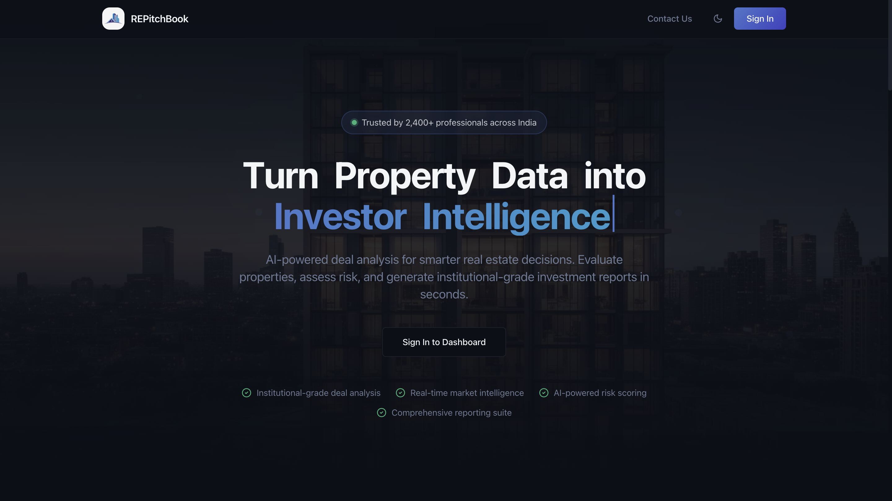

# REPitchBook 🏢

Turn property data into investor-grade intelligence — fast, structured, and actually useful.

Built during an overnight IEEE hackathon where our team secured **🥈 2nd place out of 250+ teams**.

## What this project does

REPitchBook helps you evaluate real estate deals without going through spreadsheets or guesswork.

Just enter basic property details like price, rent, and expenses — and it generates a complete investment memo with financial insights, risks, and recommendations.

## The idea

Most tools either:
- Throw raw numbers at you  
- Or give vague AI responses  

We wanted something in between —  
 **structured, decision-ready outputs that feel like a real analyst report**

## Features

- Generates structured investment memos (not just raw text)  
- Calculates ROI, rental yield, and cash flow instantly  
- Provides clear investment insights and risk factors  
- Clean dashboard to analyze and manage deals  
- Fast and responsive UI for smooth interaction  

## 🛠 Tech Stack

**Frontend (my contribution):** React, Vite, TypeScript, Tailwind CSS  

**Backend:** FastAPI, Python, Groq SDK (LLaMA 3.3 70B)  

**Other:** Render (backend deployment), Vercel (frontend deployment)  

## My Contribution

I was responsible for building the **entire frontend** of the application.

- Designed and developed the UI from scratch  
- Built reusable components and layouts  
- Integrated frontend with backend APIs  
- Focused on performance, responsiveness, and clean UX  
- Structured the app for scalability and future features  

## Screenshots

### Dashboard

### Home Page

### Generated Investment Memo

## Hackathon Experience

This project was built during an **overnight IEEE hackathon**.

- Built under tight time constraints  
- Focused on execution over perfection  
- Collaborated rapidly to ship a working product  
- Ended up securing **2nd place among 250+ teams**  

## Live Demo

https://repitchbook-ai-a3s1.vercel.app

## Final Thoughts

This wasn’t just about building something cool it was about solving a real problem under pressure.

From idea → execution → deployment in a single night, this project pushed both speed and decision-making.

